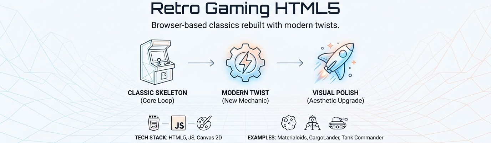

<!--
---
title: "Retro Gaming Reborn"
description: "Browser-based classics rebuilt with one modern twist, developed in the open as a worked example of spec-driven development"
author: "VintageDon (https://github.com/vintagedon/)"
date: "2026-08-14"
version: "2.0"
status: "Active"
tags:
  - type: project-root
  - domain: game-design
  - tech: [javascript, html5, canvas-2d]
related_documents:
  - "[Agent Instructions](AGENTS.md)"
  - "[Specifications](docs/specs/)"
---
-->

# Retro Gaming Reborn

[](LICENSE)



> Browser games rebuilding classics from the wireframe and early-graphics era, each with one modern mechanical twist, developed in the open as a worked example of spec-driven development.

Every game here takes a recognizable classic, faithfully reconstructs its core loop, and adds one mechanical twist that could not have existed on the original hardware. The aesthetic stays inside the wireframe and vector tradition for the early rungs, using modern rendering for polish: glow, particle sparks, smooth interpolation, colored trails. The twist is always additive, so a player who ignores it still has a playable classic.

The second thing this repository is: a public record of how the games get made. Each game is authored as a specification with matched validations, implemented by a coding agent against that spec, and reviewed in a pull request before merge. The specs, the tests that prove them, the games, and the review history are all here to read, and a fresh clone can reproduce every validation.

---

## The Method

Work is spec-driven and happens in the open.

A specification under [`docs/specs/`](docs/specs/) states the verifiable outcome and how to check it, never how to implement it. Every deliverable has matched validations, and a validation is written to fail on a subtly wrong result, not only a missing one. A coding agent implements the spec on a branch, commits once per gate, writes the tests that prove the gate's validations, and opens one pull request carrying the completed checklist and the exact commands that reproduce it. Review happens in the open, and the maintainer merges.

The specification is the durable artifact and the tests are tracked evidence. See [AGENTS.md](AGENTS.md) for the full working model.

---

## The Ladder

Games are sequenced as a complexity ladder in two arcs. Each rung adds one capability so engine techniques accumulate instead of restarting.

**Wireframe arc.** Vector games, contained Canvas 2D, zero image and audio files.

| Rung | Candidate | New capability |
|------|-----------|----------------|
| 1 | **Vector Vortex** | Fixed-step simulation, procedural geometry, scheduled topology change, first vector-FX vocabulary |
| 2 | Lunar Lander | Continuous physics, fuel and thrust, telemetry HUD, landing evaluation |
| 3 | Missile Command | Pointer targeting, limited resources, branching threats, chain reactions |
| 4 | Armor Attack / Black Widow | Navigation and obstacles, or twin-stick control and denser enemy behavior |
| 5 | Battlezone | 3D wireframes, radar, spatial enemies, cover |

**Sprite arc.** NES and 8-bit-inspired games: sprites, tiles, animation, scrolling, asset manifests, and richer audio. These commit curated finished-game assets and introduce an asset pipeline.

A custom 3D wireframe game is the eventual capstone and graduates to a Three.js or WebGPU repository. The ladder is a roadmap; the next rung is chosen after the current game ships.

---

## Current State

| Area | Status | Description |
|------|--------|-------------|
| Repository | ✅ Active | Repo-mode lifecycle, spec-driven, tracked tests, public review |
| Vector Vortex (rung 1) | 🟢 Specified | Tempest-inspired 24-lane tube shooter: a fixed-step Canvas 2D core, a scheduled topology shift, and a wireframe app shell. Two specs, MVP then twist |
| Lunar Lander (rung 2) | ⬜ Planned | Chosen after Vector Vortex ships |

An earlier experiment, Materialoids, exists in the tree from before this cadence. Its green-monochrome visual language is not a precedent; new games establish their own palette from first principles.

---

## Architecture

Each game is a self-contained static directory with no cross-game dependency.

| Component | Implementation | Purpose |
|-----------|----------------|---------|
| Rendering | Canvas 2D by default; Phaser 4 when physics or scene management is needed; Three.js or WebGPU only for 3D | The renderer matches the game, not the monorepo |
| Assets | Wireframe arc: procedural, zero files. Sprite arc: curated committed assets with a manifest | The pipeline matches the arc |
| UI chrome | The shared browser-game UI framework, themed per game | Games serve as real consumer evidence for the framework |
| Deployment | Azure Static Web Apps | Static HTML, JS, no server-side logic |
| Preview | `retrogaming.donfather.site/<game>/` | Per-game subfolder; `publish.sh` wipes only its own folder |

---

## Repository Structure

```markdown
retro-gaming-html5/
├── docs/
│   ├── specs/                    # Public specifications, the unit of work
│   └── documentation-standards/  # Templates and conventions
├── assets/                       # Repository imagery
├── <game-name>/                  # One self-contained game per directory
│   ├── AGENTS.md
│   ├── README.md
│   ├── game/                     # Servable static files
│   └── publish.sh                # Idempotent wipe-and-copy to the preview
├── AGENTS.md                     # Working model and conventions
└── README.md                     # This file
```

---

## Getting Started

Each game is a static HTML and JavaScript application with no runtime build step.

```bash
# Serve any game directory locally
cd vector-vortex/game
python -m http.server 8080

# Run a game's tracked validations (from the game directory)
npm install
npm test
npx playwright test
```

---

## License

- **Code**: [MIT License](LICENSE)
- **Original content**: [CC-BY-4.0](LICENSE-DATA)
- **Third-party assets** (sprite-arc games): retain their own licenses, recorded per game in `game/assets/MANIFEST.md`

---

Last Updated: August 14, 2026 | Status: Active
